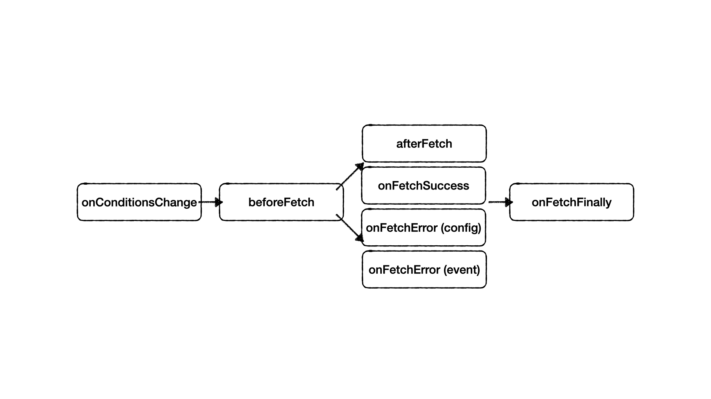

English | [中文](./README-zh_TW.md)

# vue-condition-watcher 

[](https://circleci.com/gh/runkids/vue-condition-watcher) [](https://vuejs.org/) [](https://composition-api.vuejs.org/) [](https://www.npmjs.com/package/vue-condition-watcher)  [](https://www.npmjs.com/package/vue-condition-watcher) [](https://bundlephobia.com/result?p=vue-condition-watcher) [](https://github.com/runkids/vue-condition-watcher/blob/master/LICENSE)

## Introduction

Vue composition API for automatic data fetching. With `conditions` as the core. Easily control and sync to URL query string by `conditions`
> requires Node.js 12.0.0 or higher.

## Features

  ✔ Automatically fetch data whenever `conditions` changes<br>
  ✔ `null` `undefined` `[]` `''` will be automatically filtered out before sending the request<br>
  ✔ Refreshing the page will automatically initialize `conditions` according to the query string of the URL, and will automatically correspond to the type ( string, number, array, date )<br>
  ✔ Whenever `conditions` changes, the URL query string will be automatically synchronized, and the previous page and next page will work normally<br>
  ✔ Avoid `race condition`, ensure requests are first in, first out, and can also avoid repeated requests<br>
  ✔ Do Dependent Request before updating `data`<br/>
  ✔ Easily handle paging needs, simply customize your own paging logic<br/>
  ✔ Automatically re-request data when web page is refocused or network disconnection resumes<br/>
  ✔ Support polling, the polling period can be adjusted dynamically<br/>
  ✔ The caching mechanism allows data to be rendered faster without waiting for loading animations<br/>
  ✔ No need to wait for the return result, you can manually change `data` to make the user experience better<br/>
  ✔ TypeScript support. <br/>
  ✔ Works for Vue 2 & 3 by the power of [vue-demi](https://github.com/vueuse/vue-demi)
  
  

## Navigation

- [Installation](#installation)
- [Quick Start](#quick-start)
- [Configs](#configs)
- [Return Values](#return-values)
- [Execute Fetch](#execute-fetch)
- [Prevent Request](#prevent-request)
- [Manually Trigger Request](#manually-trigger-request)
- [Intercepting Request](#intercepting-request)
- [Mutations data](#mutations-data)
- [Conditions Change Event](#conditions-change-event)
- [Fetch Event](#fetch-event)
- [Polling](#polling)
- [Cache](#cache)
- [History Mode](#history-mode)
- [Lifecycle](#lifecycle)
- [Pagination](#pagination)
- [Changelog](https://github.com/runkids/vue-condition-watcher/blob/master/CHANGELOG.md)

## Demo

[👉 Download Vue3 example here](https://github.com/runkids/vue-condition-watcher/tree/master/examples/vue3) (Use [Vite](https://github.com/vuejs/vite))

```bash
cd examples/vue3
yarn 
yarn serve
````

[👉 Download Vue2 @vue/composition-api example here](https://github.com/runkids/vue-condition-watcher/tree/master/examples/vue2)

```bash
cd examples/vue2
yarn 
yarn serve
````

### 👉 Online demo

  - [Demo with Vue 3 on StackBlitz](https://stackblitz.com/edit/vitejs-vite-tsvfqu?devtoolsheight=33&embed=1&file=src/views/Home.vue)

## Getting Started

### Installation

In your project

```bash
yarn add vue-condition-watcher
```

Or with npm

```bash
npm install vue-condition-watcher
```

CDN

```javascript
https://unpkg.com/vue-condition-watcher/dist/index.js
```

### Quick Start

This is a simple example for `vue-next` and `vue-router-next`

First you need to create a fetcher function, use the native `fetch` or libs like Axios. Then import `useConditionWatcher` and start using it.

```javascript
createApp({
  template: `
    <div class="filter">
      <input v-model="conditions.name">
      <button @click="execute">Refetch</button>
    </div>
    <div class="container">
      {{ !loading ? data : 'Loading...' }}
    </div>
    <div v-if="error">{{ error }}</div>
  `,
  setup() {
    const fetcher = params => axios.get('/user/', {params})
    const router = useRouter()

    const { conditions, data, loading, error } = useConditionWatcher(
      {
        fetcher,
        conditions: {
          name: ''
        },
        history: {
          sync: router
        }
      }
    )
    return { conditions, data, loading, error }
  },
})
.use(router)
.mount(document.createElement('div'))
```

You can use the value of `data`, `error`, and `loading` to determine the current state of the request.

When the `conditions.name` value changes, will fire the `lifecycle` to fetching data again.

Use `config.history` of sync to `sync: router`. Will store the conditions within the URL query string every time conditions change.

### Basic Usage

```js
const { conditions, data, error, loading, execute, resetConditions, onConditionsChange } = useConditionWatcher(config)
```

### Configs

- `fetcher`: (⚠️ Required) promise function for data fetching.
- `conditions`: (⚠️ Required) `conditions` default value.
- `defaultParams`: The parameters that will be preset with each request and cannot be modified.
- `initialData`: `data` returns null by default. If you want to define the initial data, you can use this parameter setting.
- `immediate`: If you don't want to automatically fetch data in the first time, you can set this parameter to `false`, and the request will not be executed until `conditions` is changed or `execute` is executed.
- `manual`: Instead manually execute `execute` function to trigger the request, even if `conditions` changes, it will not be automatically requested.
- `history`: Based on vue-router (v3 & v4), enables synchronization of `conditions` to URL's Query String. Synchronize Query String to `conditions` when the page is refreshed
- `pollingInterval`: Enable polling, can be `number` or `ref(number)` in milliseconds
- `pollingWhenHidden`: Continue polling whenever you leave the focused screen, the default is `false`.
- `pollingWhenOffline`: continue polling whenever the network is disconnected, the default is `false`.
- `revalidateOnFocus`: After re-focusing the screen, re-request once, the default is `false`.
- `cacheProvider`: `vue-condition-watch` will cache data behind, you can pass this parameter to customize `cacheProvider`
- `beforeFetch`: You can last modify the `conditions` before the request, or you can terminate the request at this stage.
- `afterFetch`: you can adjust the result of `data` before `data` is updated
- `onFetchError`: Triggered when an error occurs in the request, you can adjust `error` & `data` before `data` and `error` are updated

### Return Values

- `conditions`:<br/>
 Type: `reactive`<br/>
 Reactive objects (conditions based on config) are the main core of `vue-conditions-watcher`. Whenever `conditions` changes, the [lifecycle](#lifecycle) will be triggered.<br/>
- `data`:<br/>
Type: `👁‍🗨 readonly & ref`<br/>
Default Value: `undefined`<br/>
The return result of `config.fetcher`, will be `undefined` again when conditions changed.<br/>
- `error`:<br/>
Type: `👁‍🗨 readonly & ref`<br/>
Default Value: `undefined`<br/>
`config.fetcher` error return result<br/>
- `isFetching`:<br/>
Type: `👁‍🗨 readonly & ref`<br/>
Default Value: `false`<br/>
The status of the request being processed<br/>
- `loading`: When `!data.value & !error.value` will be `true`.
- `execute`: Trigger the request again based on the current `conditions` and `defaultParams`.<br/>
- `mutate`: `data` can be modified using this method<br/>
**🔒 ( `data` default is only unmodifiable )**<br/>
- `resetConditions`: Reset `conditions` back to their initial values
- `onConditionsChange`: Fires when `conditions` changes, returning new and old values
- `onFetchSuccess`: The request is successfully triggered and the original request result is returned
- `onFetchError`: Triggered by request failure, returning the original request failure result
- `onFetchFinally`: Fired when the request ends

### Execute Fetch

`conditions` is reactive proxy, easy execute fetch when `conditions` value changed

```js
const { conditions } = useConditionWatcher({
  fetcher,
  conditions: {
    page: 0
  },
  defaultParams: {
    opt_expand: 'date'
  }
})

conditions.page = 1 // fetch data with payload { page: 1, opt_expand: 'date' }

conditions.page = 2 // fetch data with payload { page: 2, opt_expand: 'date' }
```

Just call `execute` function to send a request if you need.

```js
const { conditions, execute: refetch } = useConditionWatcher({
  fetcher,
  conditions: {
    page: 0
  },
   defaultParams: {
    opt_expand: 'date'
  }
})

refetch() // fetch data with payload { page: 0, opt_expand: 'date' }
```

Force update conditions in time.

```js
const { conditions, resetConditions } = useConditionWatcher({
  fetcher,
  immediate: false,
  conditions: {
    page: 0,
    name: '',
    date: []
  },
})

// initial conditions then fire onConditionsChange event
resetConditions({
  name: 'runkids',
  date: ['2022-01-01', '2022-01-02']
})

// Reset conditions
function reset () {
  // You can just use `resetConditions` function to initial value.
  resetConditions()
}
```

### Prevent Request

Setting the `immediate` to false will prevent the request until the `execute`
function called or conditions changed.

```js
const { execute } = useConditionWatcher({
  fetcher,
  conditions,
  immediate: false,
})

execute()
```

### Manually Trigger Request

By default, `vue-condition-watcher` will automatically trigger fetch data. You can pass `manual` to disable the default fetch and then use `execute()` to trigger fetch data.

```js
const { execute } = useConditionWatcher({
  fetcher,
  conditions,
  manual: true,
})

execute()
```

### Intercepting Request

The `beforeFetch` let you modify conditions before fetch.
Receive two params:

- Object of clone deep conditions.
- Function called to stop fetch.

```js
useConditionWatcher({
  fetcher,
  conditions: {
    date: ['2022/01/01', '2022/01/02']
  },
  initialData: [],
  async beforeFetch(conds, cancel) {
    // await to check token before fetch
    await checkToken ()

    // conds is an object clone copy from config.conditions
    const {date, ...baseConditions} = conds
    const [after, before] = date
    baseConditions.created_at_after = after
    baseConditions.created_at_before = before

    return baseConditions
  }
})
```

The `afterFetch` can intercept the response before data updated, **also your can requests depend on each other 🎭**

```js
const { data } = useConditionWatcher({
  fetcher,
  conditions,
  async afterFetch(response) {
    //response.data = {id: 1, name: 'runkids'}
    if(response.data === null) {
      return []
    }
    // requests depend on each other
    // the loading is still be true until fire `onFetchFinally`
    const finalResponse = await otherAPIById(response.data.id)

    return finalResponse // [{message: 'Hello', sender: 'runkids'}]
  }
})

console.log(data) //[{message: 'Hello', sender: 'runkids'}]
```

The `onFetchError` can intercept the response before data and error updated

```js
const { data, error } = useConditionWatcher({
  fetcher,
  conditions,
  async onFetchError({data, error}) {
    if(error.code === 401) {
      await doSomething()
    }

    return {
      data: [],
      error: 'Error Message'
    }
  }
})

console.log(data) //[]
console.log(error) //'Error Message'
```

### Mutations data

In some cases, mutations to `data` is a good way to make the user experience better, you don't need wait for the remote data.

Use `mutate` function, you can update `data`. While `onFetchSuccess` will replace `data` again.

Two way to use mutate function:

- First way, force update current data.

```js
mutate(newData)
```

- Second way, use function will receive deep clone data, and return updated data.

```js
const finalData = mutate((currentData) => {
  currentData[0].name = 'runkids'
  return currentData
})

console.log(finalData[0]name === data.value[0].name) //true
```

#### 🏄‍♂️ Example for update a part of your data based on the current data

POST API will just return the updated data directly, so we don’t need to fetch list data again.

```js
const { conditions, data, mutate } = useConditionWatcher({
  fetcher: api.userInfo,
  conditions,
  initialData: []
})

async function updateUserName (userId, newName, rowIndex = 0) {
  console.log(data.value) //before: [{ id: 1, name: 'runkids' }, { id: 2, name: 'vuejs' }]

  const response = await api.updateUer(userId, newName)

  // 🚫 `data.value[0] = response.data`
  // Not work! Because `data` is read only.

  // Easy to use function will receive deep clone data, and return updated data.
  mutate(currentData => {
    currentData[rowIndex] = response.data
    return currentData
  })

  console.log(data.value) //after: [{ id: 1, name: 'mutate name' }, { id: 2, name: 'vuejs' }]
}

```

### Conditions Change Event

`onConditionsChange` can help you handle conditions changed.
Will return new value and old value.

```js
const { conditions, onConditionsChange } = useConditionWatcher({
  fetcher,
  conditions: {
    page: 0
  },
})

conditions.page = 1

onConditionsChange((conditions, preConditions)=> {
  console.log(conditions) // { page: 1}
  console.log(preConditions) // { page: 0}
})
```

### Fetch Event

The `onFetchResponse`, `onFetchError` and `onFetchFinally` will fire on fetch request.

```ts
const { onFetchResponse, onFetchError, onFetchFinally } = useConditionWatcher(config)

onFetchResponse((response) => {
  console.log(response)
})

onFetchError((error) => {
  console.error(error)
})

onFetchFinally(() => {
  //todo
})
```

## Polling

You can use `pollingInterval` to automatically refetch data. Just enable it by setting `pollingInterval` value.

```js
useConditionWatcher({
  fetcher,
  conditions,
  pollingInterval: 1000
})
```

And also you can use `ref`, it's will be reactivity.

```js
const pollingInterval = ref(0)

useConditionWatcher({
  fetcher,
  conditions,
  pollingInterval: pollingInterval
})

function startPolling () {
  pollingInterval.value = 1000
}

onMounted(startPolling)
```

The `vue-condition-watcher` default will disable polling when you leave the screen in focus or when the network is disconnected.

You can turn off the default behavior by setting:

- `pollingWhenHidden=true` to continue polling after leaving focus
- `pollingWhenOffline=true` will continue polling if the network is disconnected

You can also retry the request after enabling the focus screen to make sure the data is up to date.

- `revalidateOnFocus=true`

```js
useConditionWatcher({
  fetcher,
  conditions,
  pollingInterval: 1000,
  pollingWhenHidden: true, // pollingWhenHidden default is false
  pollingWhenOffline: true, // pollingWhenOffline default is false
  revalidateOnFocus: true // revalidateOnFocus default is false
})
```

## Cache

The `vue-condition-watcher` preset will cache your first data in the current component. Then the following requests will use the cached data first, silently request new data behind, wait for the latest return result and compare whether the cached data is the same to achieve a similar preloading effect.

You can also set `cacheProvider` by function to share globally or cache data in `localStorage`, and with polling, it can achieve the effect of paging and synchronizing data.

###### Global Based

```js
// App.vue
<script lang="ts">
const cache = new Map()

export default {
  name: 'App',
  provide: {
    cacheProvider: () => cache
  }
}

//Other.vue
useConditionWatcher({
  fetcher,
  conditions,
  cacheProvider: inject('cacheProvider')
})
</script>
```

###### [LocalStorage Based](https://swr.vercel.app/docs/advanced/cache#localstorage-based-persistent-cache)

```js
function localStorageProvider() {
  const map = new Map(JSON.parse(localStorage.getItem('your-cache-key') || '[]'))
  window.addEventListener('beforeunload', () => {
    const appCache = JSON.stringify(Array.from(map.entries()))
    localStorage.setItem('your-cache-key', appCache)
  })
  return map
}

useConditionWatcher({
  fetcher,
  conditions,
  cacheProvider: localStorageProvider
})
```

## History Mode

You can enable History mode by setting `config.history`, which is based on vue-router and supports v3 and v4 versions

````js
const router = useRouter()

useConditionWatcher({
  fetcher,
  conditions,
  history: {
    sync: router
  }
})
````

You can also set `history.ignore` to exclude the `key&value` in the `conditions` section from being synced to the URL query string.

````js
const router = useRouter()

useConditionWatcher({
  fetcher,
  conditions: {
    users: ['runkids', 'hello']
    limit: 20,
    offset: 0
  },
  history: {
    sync: router,
    ignore: ['limit']
  }
})

// the query string will be ?offset=0&users=runkids,hello
````

History mode will convert the corresponding types of `conditions` default values ​​to query strings and will filter out `undefined`, `null`, `''`, `[]` values.

````js
conditions: {
  users: ['runkids', 'hello']
  company: ''
  limit: 20,
  offset: 0
}
// the query string will be ?offset=0&limit=20&users=runkids,hello
````

Also automatically syncs the query string to `conditions` whenever you refresh the page

````
URL query string: ?offset=0&limit=10&users=runkids,hello&company=vue
````

`conditions` will become

````js
{
  users: ['runkids', 'hello']
  company: 'vue'
  limit: 10,
  offset: 0
}
````

## Lifecycle



- ##### `onConditionsChange`

  Fire new conditions value and old conditions value.

  ```js
  onConditionsChange((cond, preCond)=> {
    console.log(cond)
    console.log(preCond)
  })
  ```

- ##### `beforeFetch`

  You can modify conditions before fetch, or you can call second of arguments to stop fetch this time.

  ```js
  const { conditions } = useConditionWatcher({
    fetcher,
    conditions,
    beforeFetch
  })

  async function beforeFetch(cond, cancel){
    if(!cond.token) {
      // stop fetch
      cancel()
      // will fire onConditionsChange again
      conditions.token = await fetchToken()
    }
    return cond
  })
  ```

- ##### `afterFetch` & `onFetchSuccess`

  `afterFetch` fire before `onFetchSuccess`<br/>
  `afterFetch` can modify data before update.
  ||Type|Modify data before update| Dependent request |
  |-----|--------|------|------|
  |afterFetch| config | ⭕️ | ⭕️ |
  |onFetchSuccess  | event | ❌ | ❌ |

  ```html
    <template> 
      {{ data?.detail }} <!-- 'xxx' -->
    </template>
  ```

   ```js
  const { data, onFetchSuccess } = useConditionWatcher({
    fetcher,
    conditions,
    async afterFetch(response){
      //response = { id: 1 }
      const detail = await fetchDataById(response.id)
      return detail // { id: 1, detail: 'xxx' }
    })
  })

  onFetchSuccess((response)=> {
    console.log(response) // { id: 1, detail: 'xxx' }
  })
  ```

- ##### `onFetchError(config)` & `onFetchError(event)`

  `config.onFetchError` fire before `event.onFetchError`<br/>
  `config.onFetchError` can modify data and error before update.
  ||Type|Modify data before update|Modify error before update|
  |-----|--------|------|------|
  |onFetchError| config | ⭕️ | ⭕️ |
  |onFetchError  | event | ❌ | ❌ |

   ```js
  const { onFetchError } = useConditionWatcher({
    fetcher,
    conditions,
    onFetchError(ctx){
      return {
        data: [],
        error: 'Error message.'
      }
    })
  })

  onFetchError((error)=> {
    console.log(error) // origin error data
  })
  ```

- ##### `onFetchFinally`

  Will fire on fetch finished.

  ```js
  onFetchFinally(async ()=> {
    //do something
  })
  ```

## Make It Reusable

You might need to reuse the data in many places. It is incredibly easy to create reusable hooks of `vue-condition-watcher` :

```js
function useUserExpensesHistory (id) {
  const { conditions, data, error, loading } = useConditionWatcher({
    fetcher: params => api.user(id, { params }),
    defaultParams: {
      opt_expand: 'amount,place'
    },
    conditions: {
      daterange: []
    }
    immediate: false,
    initialData: [],
    beforeFetch(cond, cancel) {
      if(!id) {
        cancel()
      }
      const { daterange, ...baseCond } = cond
      if(daterange.length) {
        [baseCond.created_at_after, baseCond.created_at_before] = [
          daterange[0],
          daterange[1]
        ]
      }
      return baseCond
    }
  })

  return {
    histories: data,
    isFetching: loading,
    isError: error,
    daterange: conditions.daterange
  }
}
```

And use it in your components:

```js
<script setup>
  const { 
    daterange, 
    histories, 
    isFetching, 
    isError 
  } = useUserExpensesHistory(route.params.id)

  onMounted(() => {
    //start first time data fetching after initial date range
    daterange = [new Date(), new Date()]
  })
</script>
```

```html
<template>
  <el-date-picker
    v-model="daterange"
    :disabled="isFetching"
    type="daterange"
  />
  <div v-for="history in histories" :key="history.id">
    {{ `${history.created_at}: ${history.amount}` }}
  </div>
</template>
```

Congratulations! 🥳 You have learned how to use composition-api with `vue-condition-watcher`.

Now we can manage the paging information use `vue-condition-watcher` .

## Pagination

Here is an example use Django the limit and offset functions and Element UI.

Create `usePagination`

```js
function usePagination () {
  let cancelFlag = false // check this to cancel fetch

  const { startLoading, stopLoading } = useLoading()
  const router = useRouter()
  
  const { conditions, data, execute, resetConditions, onConditionsChange, onFetchFinally } = useConditionWatcher(
    {
      fetcher: api.list,
      conditions: {
        daterange: [],
        limit: 20,
        offset: 0
      }
      immediate: true,
      initialData: [],
      history: {
        sync: router,
        // You can ignore the key of URL query string, prevent users from entering unreasonable numbers by themselves.
        // The URL will look like ?offset=0 not show `limit`
        ignore: ['limit'] 
      },
      beforeFetch
    }, 
  )

  // use on pagination component
  const currentPage = computed({
    get: () => conditions.offset / conditions.limit + 1,
    set: (page) => {
      conditions.offset = (page - 1) * conditions.limit
    }
  })

  // onConditionsChange -> beforeFetch -> onFetchFinally
  onConditionsChange((newCond, oldCond) => {
    // When conditions changed, reset offset to 0 and then will fire beforeEach again.
    if (newCond.offset !== 0 && newCond.offset === oldCond.offset) {
      cancelFlag = true
      conditions.offset = 0
    }
  })

  async function beforeFetch(cond, cancel) {
    if (cancelFlag) {
      // cancel fetch when cancelFlag be true
      cancel()
      cancelFlag = false // reset cancelFlag 
      return cond
    }
    // start loading
    await nextTick()
    startLoading()
    const { daterange, ...baseCond } = cond
    if(daterange.length) {
      [baseCond.created_at_after, baseCond.created_at_before] = [
        daterange[0],
        daterange[1]
      ]
    }
    return baseCond
  }

  onFetchFinally(async () => {
    await nextTick()
    // stop loading
    stopLoading()
    window.scrollTo(0, 0)
  })

  return {
    data,
    conditions,
    currentPage,
    resetConditions,
    refetch: execute
  }
}
```

And use it in your components:

```js
<script setup>
  const { data, conditions, currentPage, resetConditions, refetch } = usePagination()
</script>
```

```html
<template>
  <el-button @click="refetch">Refetch Data</el-button>
  <el-button @click="resetConditions">Reset Offset</el-button>

  <el-date-picker
    v-model="conditions.daterange"
    type="daterange"
  />

  <div v-for="info in data" :key="info.id">
    {{ info }}
  </div>

  <el-pagination
    v-model:currentPage="currentPage"
    v-model:page-size="conditions.limit"
    :total="data.length"
  />
</template>
```

When daterange or limit changed, will reset offset to 0 and only fetch data again after reset offset.

## TDOD List

- [ ] Error Retry
- [ ] Nuxt SSR SSG Support

## Thanks

This project is heavily inspired by the following awesome projects.

- [vercel/swr](https://github.com/vercel/swr)

## 📄 License

[MIT License](https://github.com/runkids/vue-condition-watcher/blob/master/LICENSE) © 2020-PRESENT [Runkids](https://github.com/runkids)
